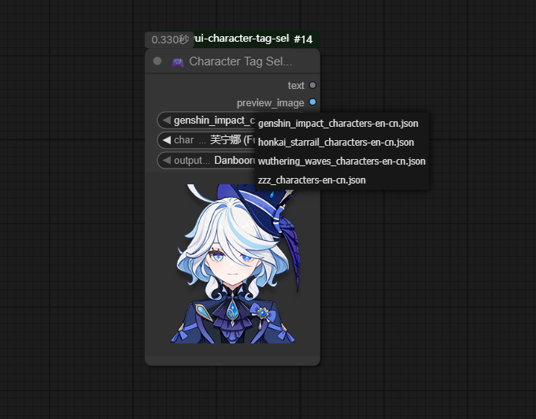
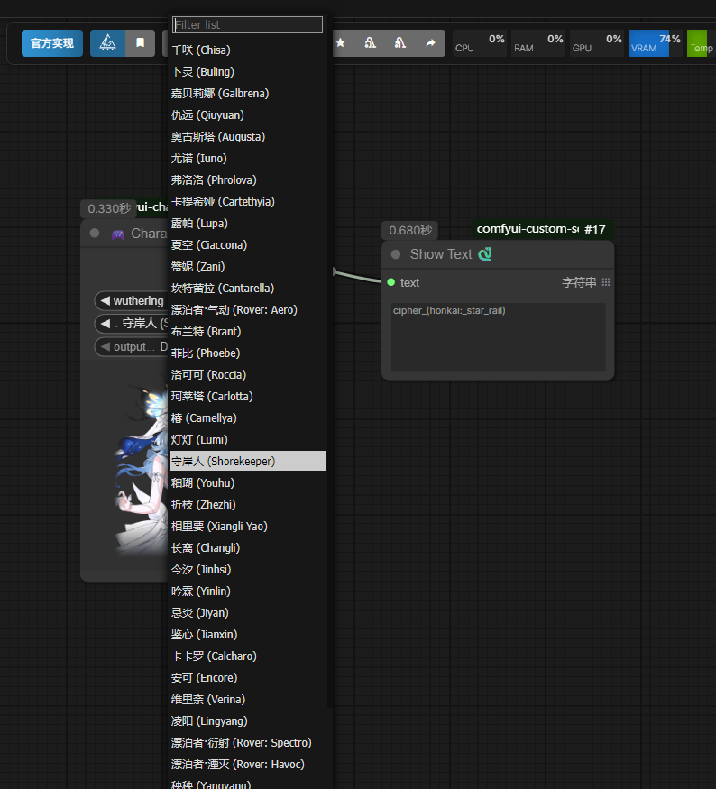

# ComfyUI 角色标签选择器节点

## 功能简介

这是一个 ComfyUI 自定义节点，用于从游戏角色数据库中选择角色，支持实时预览，并生成各种格式的标签输出。






## 作品列表(后续更新中)

- [x] 原神（Genshin Impact）
- [x] 崩坏：星穹铁道（honkai Starrail）
- [x] 绝区零（Zenless Zone Zero）
- [x] 鸣潮（Wuthering Waves）


## 安装方法

1. 将整个 `Comfyui-character-tag-selector` 文件夹复制到 ComfyUI 的自定义节点目录：
   ```
   ComfyUI/custom_nodes/
   ```

2. 重启 ComfyUI

3. 在 ComfyUI 中添加"Character Tag Selector"节点：


## 输出格式说明

| 输出类型 | 结果 |
|---------|------|
| Danbooru标签 | `raiden_shogun_(genshin_impact)` |
| 英文自然语言 | `Raiden Shogun from Genshin Impact` |
| 中文自然语言 | `雷电将军来自原神` |
| 中文名 + 作品名 | `雷电将军, 原神` |


## 开发者信息

- **版本**: 1.0.0
- **作者**: kotone,
- **仓库地址**: https://github.com/kotone/Comfyui-character-tag-selector
- **许可**: MIT
